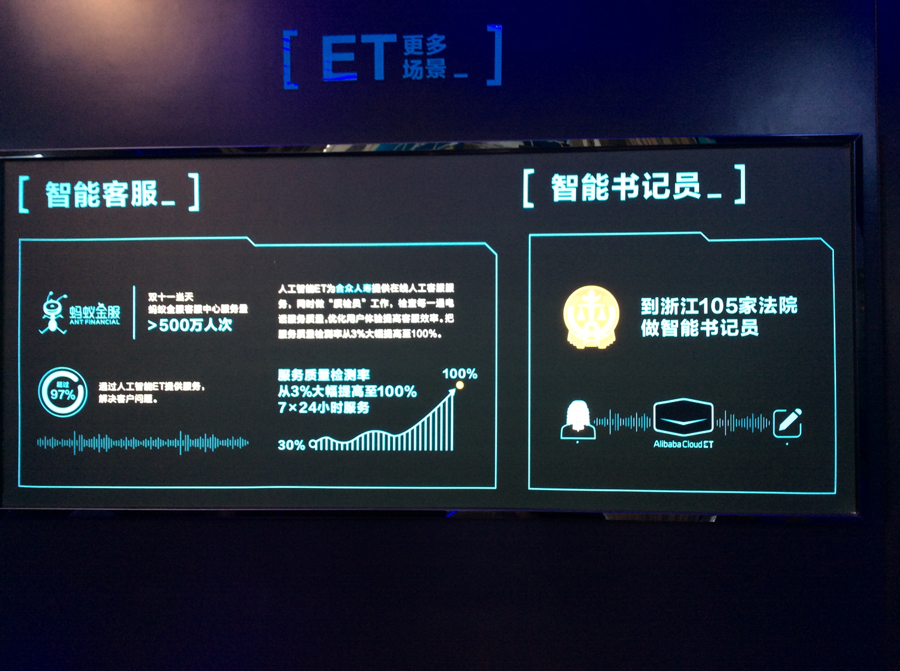

# 标逛2017年贵阳数博会

## 展商
### 阿里
财大气粗的阿里占据了一号馆的入口，吸引了不少人。此次阿里标榜的主要是：
1. 阿里云ET人工智能。此次展厅简单把官网上的一些宣传资料挂墙上了而已，写了在智能交通、智能医疗、智能客服上的一些成果。按宣传资料所说“ET的又是在于对全局的洞察和实时决策上”，估计就是基于海量数据的模型训练和实时查询。从阿里云帮助文档[链接](https://help.aliyun.com/document_detail/42745.html)中看到其支持的10余种机器学习算法在开源大数据平台也都有，而语音、图像识别等已经有很多不错的公司，其他的应用或解决方案并未看到。感觉这还是一个新的产品，期待以后有更多的落地。

1. 智能交通，主打高德地图，口号是“位置大数据赋能行业”，包括高德指数（针对线下商业，进行客源分析和区域分析，精确展现区域人群热度和人群画像）和推荐SDK（针对移动应用，协助开发者构建低成本高时效得推荐功能，赋能个性化场景）。
1. 飞天麒麟，号称“全球首台全浸没的液冷服务器”。这点子并不是阿里想出来的，但互联网企业的伟大之处之一就是“快”。不过，之前阿里也曾给天朝四大某行建过这套东西，但有点“小瑕疵”——漏水？！看来互联网自用先进技术如何商业化复制输出并没有那么简单。如何解决可靠性和可维护问题是各大传统厂商在各个战场对付互联网野蛮人屡试不爽的防狼剂。不管怎样，看好并鼓励黑科技。

### 腾讯

腾讯当然是讲他的腾讯云啦，此次推出了大数据可视交互系统RayData，主要应用场景是智慧城市，在大屏上动态的3D效果渲染和展示全景，非常有大片范儿。此次Demo的是贵州，

再盗图一个：

不过图片看不出震撼的地方，在[这里](https://v.qq.com/x/page/t0393eflrnl.html)有一个RayData的深圳城市Demo视频，和此次的很类似。

想象一下吧，一个指挥中心或展示厅，用一个iMAX的屏做这样的可视化展现...对比俺们现在好多地方还只是excel导出的二维透视表，羞涩啊...网上查了下，应该是一家叫RayKite（[北京光启元公司](http://www.raykite.com)）创业公司的产品，是腾讯的战略合作伙伴，以前似乎有文化传媒的背景，难怪，艺术圈儿的，果然和IT圈画风不一样。

另外也宣传了一下反诈骗平台：

和人工智能，主要是人脸识别，哄哄小姑娘：

### 360

360推的是面向企业的云安全服务，与企业的网络对接，将网络日志发送到360云端进行安全监控。

总结：

### Dell

总结：我们不产大数据，我们只是大数据的搬运工。

### Oracle

任性的Oracle放了一个大屏播NBA在“你懂的”球馆里的比赛。唯一有“大数据”几个字的就只有这个：

总结：感觉就是有钱，过来捧个场。

### 浪潮

参观了展台才知道浪潮在政府行业的根基这么深，整个展区除了一丢丢是“企业云”以外，其他的都是和政府相关的应用。

#### 企业大数据

浪潮企业云分为私有云和公有云。公有云主要是业务SaaS类租赁服务，主要是财务云。从这幅空洞又缺乏逻辑的图，感觉浪潮做企业市场太不走心了。

浪潮的产品从下到上全有，包括ETL产品、爬虫、数据展示产品、BI产品、元数据管理等等。和浪潮一个开发经理聊，为什么要自己造轮子，答曰，反正没什么技术难度，找几十个人做了就行了，自己能赚的钱自己赚。

#### 警务

首先出场的是警务云，虽然材料很空洞，但别人好心写了双语，正好学习一下，以后咱写PPT也好提高B格。

公安里有一个应用叫警务百度，类似于全文检索。而浪潮的名字很霸气，叫“警务千度”。

里面有一个案例是说通过发现某小区里有用电量很高的情况，发现原来是恐怖组织。案例真实性无法考证，但这么简单粗暴的场景不知道你信不信，反正我是不信，不过觉得用来抓群租应该是可以的。

这幅图是让我尴尬的地方，“碰撞”是特有黑话啊，不是“冲突”啊，目的不是找出有矛盾的错误数据，而是有共性的数据呀呀呀

还有浪潮也做大数据投资

这里是
#### 精准扶贫云

浪潮在贵州做的项目，现在在全国推广了。以前扶贫数据过时，且不准确，浪潮配合政府逐户采集数据，并与政府部门其他数据

“精准分析：与政府部门其他数据对接，如住房数据。以前政府之间的数据不能共享，因此可能有人买了房还在领救助款。”

“精确调度：根据贫困类型，进行针对性扶贫，如技能不足类的安排培训，伤残类的安排就医等。”

对于政府扶贫的业务不懂，不知道痛点，但从得到的信息来讲，这更多的是一个传统的IT项目，工作核心是信息化。就技术而言，这623万人的扶贫信息，还不是高频数据，就算一个人1MB，也撑不满一台服务器，哪里来的云和大数据？

#### 政府数据治理

虽然标题是“浪潮大数据”，从材料上讲可能是基于贵州省的一个数据项目提炼出来的方法论。

#### 民政大数据

感觉里面和传统应用系统没什么不同，不知道所谓的“统一”、“资源大集中”、“智能决策”都是什么老虎。和大数据相关的还是这页，即通过外部车辆、存款、房产等信息与低保人群信息进行比对核查。

#### 教育大数据

总结：政府地头蛇，土著集成商。传统政府各级、各部门的IT系统相互独立建设，现在似乎导向是统一。展台内容突出应用，所有的PPT别说技术了，连个软件截图都没有，估计目标受众是政府高层领导。对不起，乱入了。

### 中兴

此次中兴大数据的主力是旗下的一家叫[中兴飞流](http://www.jetflow.com.cn/)子公司，据工作人员说公司2015年成立（工商资料中公司实际成立是2016年2月），现在员工60人左右。其主打的应用是交通，叫“速观智能视频分析一体化平台”，在服务器端识别视频和图片，结构化后提供快速的查找。据称识别算法还是自己的。

还有一体机方案。

核心竞争力是自研的“全球首个基于数据流技术的大数据计算引擎”Yita，据说流性能要优于Storm，批处理性能优于Spark，兼容Hadoop生态系统。展区里工作人员是销售线的，所以没问具体，从架构图上是和Spark/Storm平行的，能跑在YARN上。可别是打磨[Apache Beam](http://beam.apache.org/)的山寨货啊。

对了，知道中兴出品的Hadoop叫什么么？ZDH？错了，叫JDH，哇哈哈。

然而，后面还有一家中兴的儿子，叫中兴力维得，也做同样的事情，而且居然两家相互都不知道对方的存在。中兴真有趣。

心疼中兴的小哥，还在现场改PPT@@。

总结：

### HPE/DXC

还不知道DXC的同学看这堵墙，前生就是HP企业服务部。

也有交通领域的服务方案。

总结：这次带来的货不多，感觉是陪太子读书来的。

### SAP

SAP也是在一号馆，装修得像商场一样，摆了几件西服，里面基本上没什么人。推数字化零售方案，宣传资料里连Hadoop都“懒得”挂了。直接路过...

总结：看图吧...

### 华为

华为摆了一个赛车游戏机，和真实赛车大小一样的模型，还有前面一个大大的屏幕，吸引了很多人排队。真正的展区就是一个个的屏幕，分行业和应用播放和不同生态伙伴的解决方案。除了自己的FI大数据平台，站台的多为合作伙伴。

### 搜狗

搜狗也把自己内部使用的数据分析平台对外做价值输出了，场景主要是基于标签的市场分析，类似百度凤巢。据工作人员说，除了搜狗输入法自己的数据,还得到腾讯许可能拿到微信的所有数据，这就厉害了哦。

### 慧数

## 花边
1. 大娘们组团逛数博会。在数博会门口就像旅游景点一样，有很多摇着小旗子的“导游”，领一队队戴着整齐帽子的大爷大妈团，浩浩荡荡地进军数博会会场。大妈都大数据了？顿时压力大:)
1. 在线直播火爆。现场有很多妹子像逛街一样直播数博会，嗯是妹子，全是妹子，连“工作人员”都是妹子。我似乎有点穿越ChinaJoy？大数据能吸引妹子来，这绝逼是IT民工转型的强大动力啊！

## 总结

1. 各种“第一”满天飞。不是新广告法都出来了吗，有人管不？
1. 百度
1. 生态。阿里，华为 抱团取暖
1. 要想被赶出去就问和别人到底有什么不同，核心竞争力在哪里？
1. 在“自主可控”大旗下，外企的机会不大。参会可能政府人员居多，有点画风不符。
